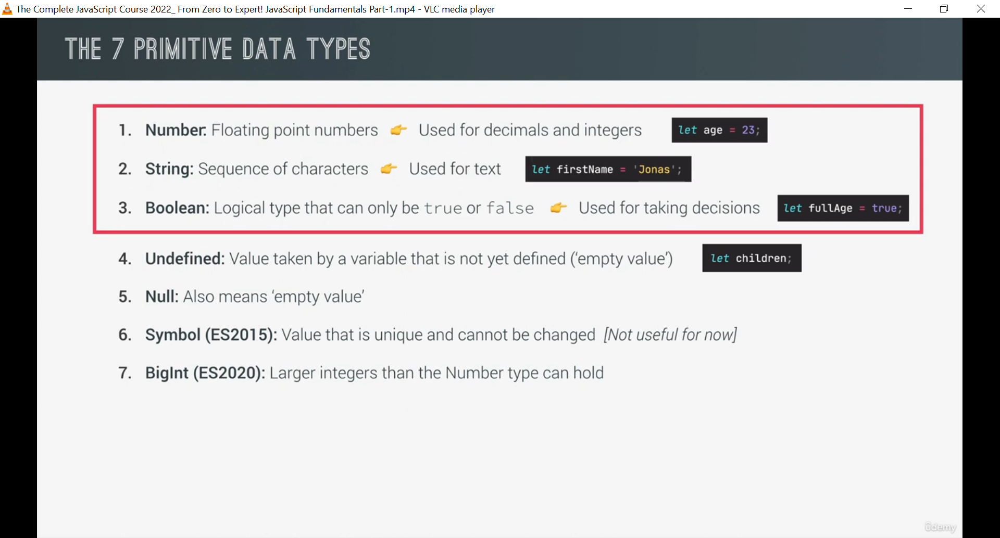

# Data Types

In every programming language `values` can have *different* *types* depending on the type of data that we want them to hold


>In `JavaScript` every value is either ***object*** or ***primitive*** ***value***


`Note` A value is only a primitive when its not an object


## 7 Primitive Data Types


## 1. Numbers

Floating point numbers � used for decimals and integers


`Example`
```js
let age = 23;
```


## 2. Strings

Sequence of characters � used for text

`Example`
```js
let firstName = 'jonas';
```


## 3. Boolean

Logical type that can only be `true` or `false` used for taking decisons 

`Example`
```js
let fullAge = true;
```


## 4. Undefined 


Value taken by a variable that is not *yet* *defined* (`empty value`)

`Example`
```js
let Children;
```


## 5.Null

Also means `empty value`


## 6. Symbols
Value that is unique and cannot be changed 


## 7. BigInt

Larger integers than the number type can hold





> JavaScript has dynamic typing 
> its the value that has the type not the variable.