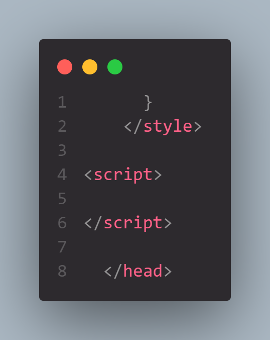
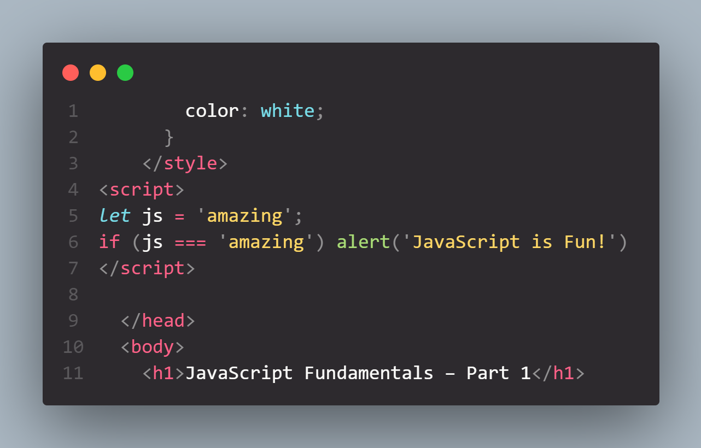
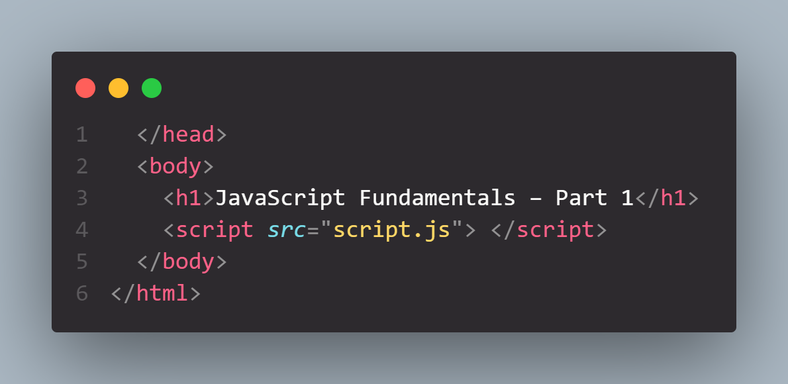

# Fundammentals

> Usually Javascript is used in Browsers, when you're building Front end applications so we need an HTML Document, Because our JS needs to be attached to an HTMl document

In HTML there's an `script` tag in which we can write our javascript

it comes just beneath the `style` tag.

Just as we wrote in `console` now we implemented the same in our HTML file via the help of `<script>` tag

Right now we are working in an inline script

## External JavaScript:

Now we are going to put aside the `js` code into its seperate file

created a newfile names `script.js`
now we will have to link javascript to our HTML Document

In the � above image we linked our javascript file to the html file via the script tag
its much easier to work with and is much cleaner
